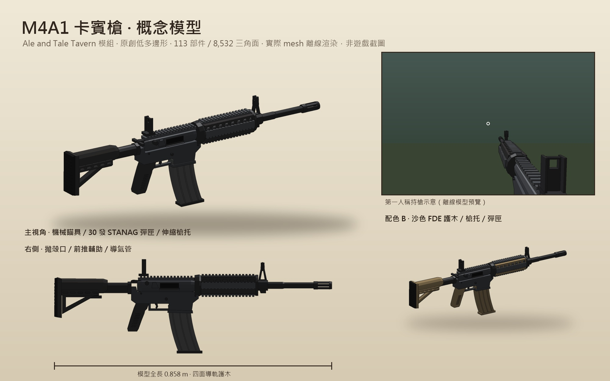
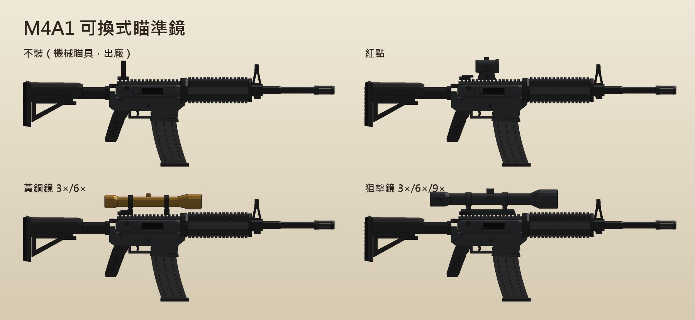
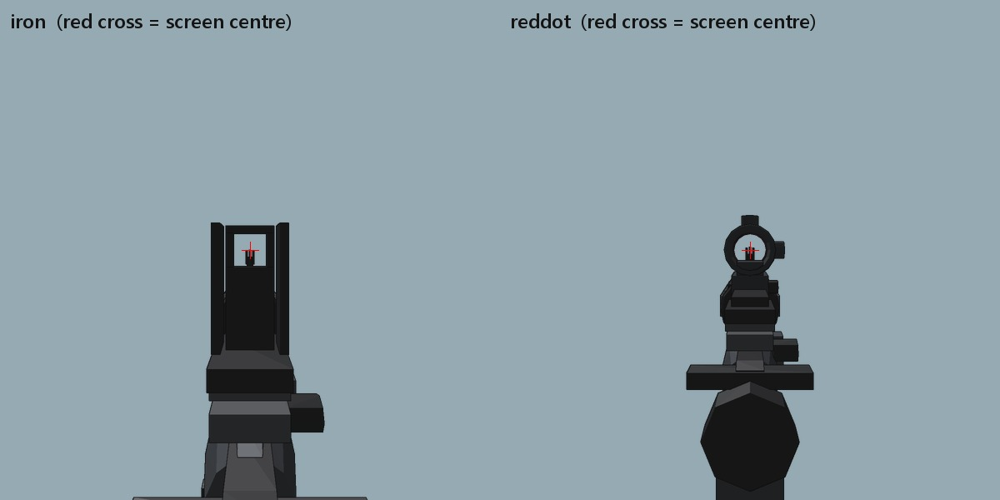
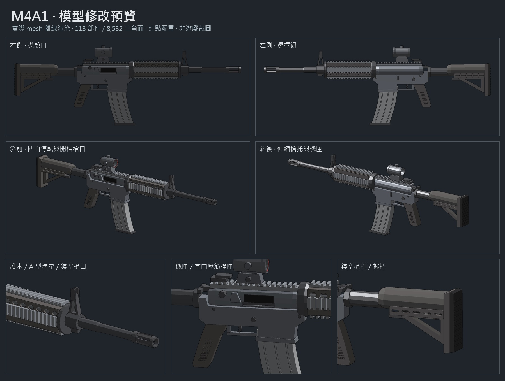

# M4A1 步槍 0.16.1

以原版火槍為底的全自動 M4A1。模型、圖示與音效全部由本專案原創生成，沒有使用第三方模型或錄音。



## 取得與操作

1. 房主和所有玩家安裝同版 `TONY_BIG_SET.dll`，重啟遊戲。
2. 商人販售兩樣新商品：
   - **M4A1 步槍**（物品 ID 47930）：**1 元**。買到時已裝滿 30 發，出廠為機械瞄具。
   - **5.56 子彈**（ID 47931）：**1 元買 1000 發**。沿用原生商店的「一次買一整疊」規則，`maxStack = 1000`，不需要額外 patch。
3. 操作：
   - 按住左鍵連發（750 RPM）；**B** 切換全自動／半自動，槍上的選擇鈕會跟著轉。
   - **R** 換彈：戰術換彈 2.2 s，空倉換彈 2.6 s（多拉一次槍機）。換彈只扣實際缺的子彈數。
   - 打空時會自動換彈；按右鍵開鏡，操作依裝的鏡而定（見下方）。
4. 右下角顯示「彈匣 / 容量　背包子彈　模式　瞄準鏡」。

## 可換式瞄準鏡



| 瞄準鏡 | 物品 ID | 右鍵 | 開鏡方式 | 開鏡散布 |
|---|---|---|---|---|
| 不裝（機械瞄具，出廠） | 無 | 1.3× | 槍移到畫面中央，照門鬼環對準準星 | 60% |
| 紅點 | 47932 | 1.5× | 對準，紅點投在鏡筒中央 | 45% |
| 黃銅鏡 | 47935 | 3× → 6× → 收起 | 放大鏡畫面，十字 | 35% |
| 狙擊鏡 | 47936 | 3× → 6× → 9× → 收起 | 放大鏡畫面，mil-dot | 25% |

- 每種鏡在商店各賣 **1 元**（`ScopePrice`）。
- **安裝**：開背包，把鏡拖到 M4A1 上。原本的鏡會放回背包，背包滿了就掉在腳邊。箱子裡的槍也可以這樣裝。
- **拆下**：拿著 M4A1 按 **U**（`DetachScopeKey`），鏡回到背包，改用機械瞄具。遊戲預設的 T 是定位鍵，所以沒有用 T。
- 疊在同一格的相同 M4（9999 堆疊）只會有被拖到的那一把換鏡，其餘的分到另一格。
- 其他玩家看到的第三人稱模型與地上的槍都會顯示正確的鏡；火槍不受影響，維持黃銅鏡 3×／6×。



上圖是從眼睛位置離線渲染的兩種 1× 瞄具，紅十字是畫面中心：照門鬼環與紅點鏡筒都對在前準星的尖端。

## 數值（`BepInEx/config/Tony.TeammateHealthBars.cfg` 的 `[M4]`）

| 設定 | 預設 | 說明 |
|---|---|---|
| `Price` / `AmmoPrice` / `AmmoPerPurchase` | 1 / 1 / 1000 | 槍價、子彈價格、每次購買的發數 |
| `Damage` | 9 | 每發傷害（火槍 35、弩 15） |
| `RoundsPerMinute` | 750 | 全自動射速 |
| `MagazineSize` | 30 | 彈匣容量（影響新買的槍與換彈上限） |
| `Durability` | 3000 | 打 3000 發壞，可像火槍一樣修理 |
| `ReloadSeconds` | 2.2 | 戰術換彈時間；空倉另加 0.4 s |
| `RecoilScale` | 1 | 每發鏡頭上跳約 0.4°（開鏡 0.3°），0 關閉 |
| `FireModeKey` | B | 切換射擊模式 |
| `SandFurniture` | false | 改用沙色 FDE 護木、槍托、彈匣 |
| `Volume` | 0.8 | 槍聲音量，會再乘上遊戲的音效音量 |
| `ModelScale` / `FirstPersonOffset` | 0.85 / `0,0,0` | 微調第一人稱槍的大小與位置 |
| `ScopePrice` / `DetachScopeKey` | 1 / U | 瞄準鏡價格、拆鏡按鍵 |
| `SellInShop` | true | 關閉後商店不賣，已持有的仍可使用 |

以遊戲資料推算（全部命中、不計防禦）：殺一隻狼（120 HP）約 1.0 s，OrcMelee（200 HP）約 1.8 s，SpiderBoss（600 HP）約 9.7 s；火槍分別要 4.5 / 7.5 / 25.5 s。

## 實作方式

- **物品**：在 `ItemManager.Awake` 前複製原版火槍（360）與子彈（290）的 ItemData，改 ID、名稱、圖示、價格、`maxCharge = 30`、耐久；解除等級與任務限制、不列入戰利品掉落。ID 若已被其他模組佔用會停用並記錄錯誤。
- **射速**：原生 `Fire()` 要等 0.5 s 的 `musket_fire` 動畫結束才能再開槍，原生 Auto 最多約 2 發/秒。M4 以 prefix 取代 `Fire()`：不觸發開火動畫，由 `fireRate = 0.08 s` 控制，仍呼叫原生 `RaycastShot`，所以命中、傷害與網路同步都走原生流程。
- **換彈**：原生 `Reload()` 會扣掉缺額的子彈，但只呼叫 `AddItemChargeServerRpc(id, 1)`。M4 改送實際數量，伺服器端本來就會限制在 `maxCharge` 內。
- **連線負載**：扣彈與耐久 RPC 本來就接受數量，每 6 發或 0.5 秒合併送一次，每人每秒約 4 次背包清單更新。敵人警覺噪音每 0.4 秒送一次。
- **重入保護（0.14.1）**：房主端 ServerRpc 會同步執行，背包變動會經 `OnItemsChanged → CheckReload → Reload` 立刻呼叫回來。所以送出前先清空待送計數，換彈也先標記再送 RPC。0.14.0 因為順序相反，在打空彈匣時遞迴到 stack overflow 而閃退。
- **模型**：火槍的第一人稱本身沒有手部模型。M4 借用火槍的收放槍與換槍動畫，隱藏原版 mesh，把 M4 掛在 `MusketRoot/Musket`。第三人稱（`PlayerAnimTP`）與地上掉落物（`CollectibleNet`）也換成 M4，並套用火槍的持槍姿勢（`TorsoState = 3`）。
- **音效**：遊戲關閉了 Unity 內建音訊，所有聲音都走 FMOD。啟動時以程式合成槍聲（3 種變化）、空倉、退彈匣、上彈匣、拉槍機與切換模式音，透過 FMOD Core 播放並乘上 `bus:/Sound` 音量；其他玩家的槍聲經房主轉送，有 3D 距離衰減與槍口火光。FMOD 失敗時改用原生弩聲並寫入 log。
- **瞄準鏡**：共用火槍瞄準鏡的 FOV、靈敏度與射擊時還原 FOV 的邏輯。放大鏡各有準星：黃銅鏡是十字，狙擊鏡是 mil-dot。火槍維持黃銅鏡與 3× → 6× → 收起。
- **可換鏡的狀態**：裝了哪種鏡存在槍的 `Item.metaInt` 低位元組。原生只有樂透彩券會寫這個欄位，它會跟著存檔（`SavedCont.items`、`SavedColl.item`）與 `Item.NetworkSerialize` 同步；9999 堆疊也會把值不同的槍分開放。值 0 是出廠機械瞄具。0.16.1 移除了全像（3）與 ACOG（4）：存檔裡裝著這兩種鏡的槍、以及 0.14.x 的舊槍（值 0，原本是 ACOG）都改成機械瞄具；其餘鏡的值與物品 ID 不變。
- **安裝**：鏡的 `useItemOnItemType` 設成 40。原生在背包拖曳時，只要這個值不是 0，房主端就會呼叫 `ItemManager.UseItemOnItem`，而它原生只處理 1（修理）和 2（重鑄）。M4 以 prefix 接手：目標是 M4 才安裝並回傳成功，否則交回原生，照常交換位置。
- **拆下**：客戶端按 U 送出請求，房主驗證是自己背包裡的 M4 後改回機械瞄具，把鏡放回背包。
- **其他玩家的鏡**：遠端只會同步「手上拿的是哪種物品」，不知道是哪一把。持槍者開始拿槍、換鏡時，以及每 3 秒，會經房主廣播一次自己的鏡，第三人稱模型據此切換。
- **1× 對準**：`FPView/Hands`（`PlayerMovement.fpHands`）原生只會被 `SetActive`，沒有程式寫它的位置。開鏡時在 `LateUpdate`（Animator 之後）把整組第一人稱物件平移旋轉，讓瞄具點落在攝影機正前方，槍管與視線平行；0.14 秒淡入淡出，收鏡、換物品或停用時立刻還原。對準點設在 `Recoil` 節點外，後座力仍會讓瞄具跳動。
- **散布**：首發 0.9，連射每發 +0.14，上限 3.2（原生 `spreadAngle` 單位），停火 0.12 秒後開始回復。

## 模型與素材



依提供的 M4A1 參考圖調整：四面 Picatinny 導軌與通風孔、鏤空伸縮槍托、A 型準星開孔、鳥籠式槍口、圓角機匣、握把紋路，以及縮短並改用直向壓筋的 STANAG 彈匣。維持原本的骨架、槍口位置與 ADS 瞄準點；重複細節合併成 mesh，將部件數限制在 150 以下，三角面預算調整為 10,000。保留 FDE 護木配色。

目前仍是平面著色的遊戲模型，尚未加入參考圖的磨損與 PBR 貼圖；預覽從同一份 model.json 渲染。這次為模型資產更新，未替換遊戲 DLL，也未做遊戲內驗證。


- `tools/create-m4-model.js` 產生 `Assets/model.json`：113 個部件、8,532 三角面（同一時間只顯示一種鏡），全長 0.858 m（真槍 0.838 m），寬度加粗 6% 以配合遊戲的道具比例。
- 瞄準鏡各自一個 `role`（`scope-reddot`、`scope-brass`、`scope-sniper`），後照門分成立起（`iron-up`）和折下（`iron-down`，狙擊鏡座會蓋住所以不畫）。紅點是空心鏡筒，對準時看得穿。
- `tools/render_m4.py` 離線渲染：`review` 多角度模型圖、`sheet` 概念圖、`icons` 背包圖示（槍、子彈、三種鏡，256×256）、`scopes` 四種配置對照、`ads` 1× 瞄具從眼睛看出去的畫面。
- 資料採 Unity 左手座標（+X 右、+Y 上、+Z 槍口），可動部位（彈匣、拉柄、扳機、選擇鈕）各自一根骨頭。

## 驗證

```powershell
.\build.ps1
.\tests\run-m4.ps1
.\tests\run-scope.ps1
```

`run-m4.ps1` 包含：
- 116 項規則檢查：射速、換彈數量、RPC 合併與重入、散布、擊殺時間、瞄準段數、鏡的 `metaInt` 編碼（含已移除的 3／4 讀成機械瞄具）、物品 ID 對應（47933／47934 不再是鏡）、安裝／拆卸／拆疊決策、各鏡參數、紅點大小、合成音效。
- 17,903 項模型檢查：索引、非退化三角形、所有部件封閉且外向繞序、尺寸、圖示格式；照門鬼環中心與前準星尖端都在 `M4Scopes.cs` 的 `SightY = 0.091`，紅點在鏡筒軸線上且沒有不透明鏡片。
- 131 項 Cecil 靜態檢查：遊戲 API、兩個原生限制仍存在、商店一整疊定價、拖曳會走到 `UseItemOnItem` 且原生只處理 1/2、`metaInt` 只有 Item 建構子與樂透會寫且有存檔與同步、`fpHands` 沒有新的原生使用者、FMOD／Netcode API、Harmony handler 參數、嵌入資源為最新版。

**尚未做遊戲內驗證**（build 與靜態測試無法取代）。建議實測：

- 商店價格與圖示；買子彈得到 1000 發；背包 9999 堆疊。
- 第一人稱模型位置與火槍手部是否對齊（不對時調 `ModelScale` / `FirstPersonOffset`），收放槍動畫。
- 按住連發、放開停火、半自動、打空自動換彈、R 戰術換彈、換彈途中切換物品。
- 開鏡準星、開鏡射擊散布、換彈時自動收鏡；火槍 3×/6× 不受影響。
- 槍聲音量是否跟著遊戲音效滑桿；主機與客機互相聽到槍聲、看到槍口火光與第三人稱模型。
- 耐久用完損壞、修理；存檔後重讀彈匣數；死亡與斷線。
- 換鏡：把三種鏡各拖到槍上一次、在箱子裡換鏡、背包滿時換鏡；按 U 拆下；存檔重讀後鏡還在；疊在一起的兩把 M4 只換一把。
- 1× 對準：機械瞄具、紅點開鏡時槍是否移到中央、準心對齊、後座力與換彈中斷；收鏡後切換其他工具位置是否正常。
- 放大鏡：黃銅 3×/6×、狙擊 3×/6×/9× 的倍率循環與準星。
- 主客機互相看到對方換鏡後的第三人稱模型；地上的槍顯示正確的鏡。

## 限制

- 所有玩家都要安裝同版 DLL；沒裝的玩家存檔裡會出現未知物品 ID。移除模組前請先賣掉或丟掉 M4 與 5.56 子彈。
- 第三人稱持槍姿勢沿用火槍，手的位置可能沒有完全貼合 M4。
- 彈殼與槍口火光只在第一人稱與其他玩家的第三人稱模型上顯示，不會留在地上。
- 1× 對準沒有另外做手部動畫；火槍的第一人稱本來就沒有手，所以只會看到槍移到中央。
- 其他玩家剛加入時，最多要等 3 秒才會看到持槍者裝的鏡（在那之前顯示機械瞄具）。
- 0.15.0～0.16.0 買的全像／ACOG 鏡（ID 47933／47934）在 0.16.1 起不再註冊，留在背包或箱子裡會成為未知物品；更新前可先丟掉或賣掉。裝著它們的槍改用機械瞄具，鏡不會退回。
